# Analytics Service

Ingests playback and user interaction events, aggregates data for dashboards and ML pipelines, and exposes query endpoints.

## Responsibilities

-   High-throughput event ingestion (> 100k events/s)
-   Stream processing for real-time and batch analytics
-   Store time-series and event data for OLAP queries
-   Serve aggregated metrics via REST API
-   Publish derived events (e.g., `VideoWatched`, `VideoError`)

## API Endpoints

| Method | Path     | Description              |
| ------ | -------- | ------------------------ |
| POST   | /events  | Ingest a batch of events |
| GET    | /metrics | Query aggregated metrics |

## Data Stores & Pipelines

-   Ingestion: Apache Kafka or AWS Kinesis (partition by `userId`)
-   Storage: ClickHouse for OLAP (columnar storage), Elasticsearch for log search
-   Batch storage: BigQuery for long-term analytics
-   Schema registry via Confluent/Avro

## Implementation Details

## Non-Functional Requirements

-   High throughput (>100k events/s)
-   Exactly-once delivery semantics
-   Low query latency (<100ms p95)
-   99.9% availability

#### Deployment & Configuration

-   Kubernetes Deployment: Kafka Connect, StatefulSets for ClickHouse and Elasticsearch, HPA on CPU/memory
-   ConfigMap/Secrets for Kafka topics, ClickHouse tables, schema registry URLs
-   Autoscaling for ingestion and processing pods based on throughput

#### Security & Compliance

-   JWT auth for `/metrics` endpoint
-   IP whitelisting for ingestion and admin APIs
-   Data encryption in transit (TLS) and at rest (ClickHouse, Kafka)

#### Performance & Scalability

-   Kafka partitioning and replication for fault tolerance and high throughput
-   Async batching in REST producer (max 1k events, flush interval 50ms)
-   Stream processing with Flink/Spark, checkpointing every 5s
-   ClickHouse replicaset and shard setup for OLAP queries

#### Observability & Monitoring

-   Logging: structured JSON via Zap, shipped to Elasticsearch
-   Metrics: Prometheus exporters on ingestion and processing, expose `/metrics`
-   Tracing: OpenTelemetry spans across HTTP, Kafka, Flink/Spark, ClickHouse
-   Alerts: ingestion error rate >1%, processing lag >10s

#### CI/CD & Testing

-   GitHub Actions: lint, Go unit tests, integration tests using localstack Kafka mock and ClickHouse test instance
-   Docker image build and push on successful pipeline

#### Boundary & Data Flow

-   Receives POST `/events` requests via API Gateway and writes them to Kafka/Kinesis ingestion streams.
-   Consumes Kafka/Kinesis topics with Flink/Spark for real-time aggregation, storing results in ClickHouse and Elasticsearch.
-   Runs batch ETL (Airflow) to backfill and push aggregated data into BigQuery for long-term analytics.
-   Exposes GET `/metrics` via API Gateway, querying ClickHouse for aggregated metrics responses.

## End-to-End Flow

```mermaid
sequenceDiagram
    participant Client
    participant API_Gateway as API Gateway
    participant AnalyticsService as Analytics Service
    participant Kafka as Kafka/Kinesis
    participant Flink as Stream Processing
    participant ClickHouse as OLAP Store
    participant Elasticsearch as Log Store
    participant Airflow
    participant BigQuery as Batch Store

    Client->>API_Gateway: POST /events
    API_Gateway->>AnalyticsService: forward events
    AnalyticsService->>Kafka: produce events
    Kafka->>Flink: stream events
    Flink->>ClickHouse: write OLAP data
    Flink->>Elasticsearch: write logs
    Airflow->>BigQuery: batch ETL
    Client->>API_Gateway: GET /metrics
    API_Gateway->>AnalyticsService: request metrics
    AnalyticsService->>ClickHouse: query metrics
    ClickHouse-->>AnalyticsService: return metrics
    AnalyticsService-->>API_Gateway: respond with metrics
    API_Gateway-->>Client: metrics response
```

