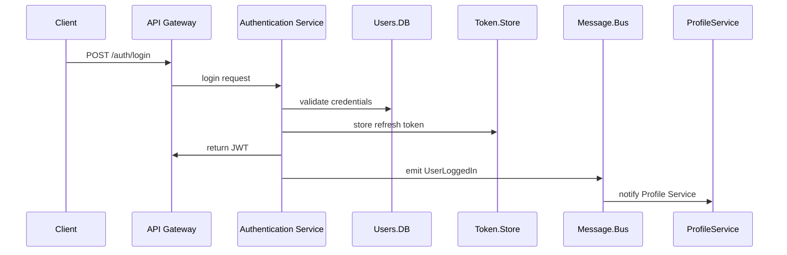

# Authentication Service

Handles user identity, registration, login/logout, token management, and security.

## Responsibilities

-   User signup (email/password, OAuth2 SSO)
-   Login, logout, JWT issuance and refresh
-   Password reset (email flow) and account recovery
-   Role-based access control and permission management
-   Integration with external identity providers (Google, GitHub)

## API Endpoints

| Method | Path                          | Description                  |
| ------ | ----------------------------- | ---------------------------- |
| POST   | /auth/signup                  | Register a new user          |
| POST   | /auth/login                   | Authenticate and issue JWT   |
| POST   | /auth/refresh                 | Refresh access token         |
| POST   | /auth/logout                  | Revoke refresh token         |
| POST   | /auth/password-reset          | Send password reset email    |
| POST   | /auth/password-reset/complete | Set new password using token |
| GET    | /auth/me                      | Get current user profile     |

## Data Stores

-   PostgreSQL with connection pooling (pg-pool, max 20 clients)
-   Redis for refresh-token blacklist and login attempt counters

## Events Published

-   `UserRegistered`
-   `UserLoggedIn`
-   `PasswordResetRequested`

## Implementation Details

## Non-Functional Requirements

-   99.9% availability
-   Rate limit: 100 req/min per IP
-   JWT expiry: 1h access, 7d refresh
-   OWASP compliance (CSRF, CORS, brute-force protection)

#### Deployment & Configuration

-   Docker container on Kubernetes, 3+ replicas, liveness/readiness probes on `/health`
-   Config via ConfigMap, secrets from HashiCorp Vault

#### Security & Compliance

-   Password hashing: bcrypt cost factor 12 (configurable)
-   JWT: RS256 with JWKS public key endpoint
-   Security headers via Helmet, CORS restricted to trusted origins, CSRF tokens for form endpoints

#### Performance & Scalability

-   Rate limiting: `rate-limiter-flexible` middleware
-   Connection pooling: PostgreSQL pg-pool (max 20), Redis for token blacklist and counters

#### Observability & Monitoring

-   Logging: Winston JSON logs (INFO request, ERROR failures) shipped to ELK
-   Metrics: Prometheus (`prom-client`), expose `/metrics`, custom JWT and refresh metrics
-   Tracing: OpenTelemetry auto-instrumentation with W3C Trace Context

#### CI/CD & Testing

-   GitHub Actions: lint, Jest unit tests, Docker image build and push
-   Integration tests: in-memory Postgres, Redis mocks

#### Boundary & Data Flow

-   Receives user registration, login, refresh, and password reset requests via API Gateway.
-   Validates and persists user data in PostgreSQL; tracks tokens and counters in Redis.
-   Publishes `UserRegistered`, `UserLoggedIn`, and `PasswordResetRequested` events to the message bus for downstream consumers.

## End-to-End Flow

