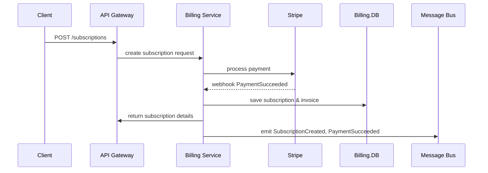

# Billing & Subscription Service

Manages subscription plans, payments, and entitlements.

## Responsibilities

-   Create and manage subscription plans
-   Process payments via Stripe
-   Handle invoices, cancellations, and trial periods
-   Publish billing events for analytics and downstream systems

## API Endpoints

| Method | Path                       | Description                               |
| ------ | -------------------------- | ----------------------------------------- |
| POST   | /subscriptions             | Create a new subscription                 |
| GET    | /subscriptions/{userId}    | Fetch active subscription for a user      |
| POST   | /subscriptions/{id}/cancel | Cancel an existing subscription           |
| GET    | /plans                     | List available subscription plans         |
| POST   | /payments/webhook          | Receive payment gateway webhooks (Stripe) |

## Data Store

-   PostgreSQL (`subscriptions`, `plans`, `invoices` tables) with pool (max 15 connections)

## Events Published

-   `SubscriptionCreated`
-   `PaymentSucceeded`
-   `PaymentFailed`
-   `SubscriptionCanceled`

#### Boundary & Data Flow

-   Receives subscription creation, cancellation, and plan queries via API Gateway.
-   Processes payment webhooks from Stripe; persists subscription and invoice data in PostgreSQL.
-   Emits `SubscriptionCreated`, `PaymentSucceeded`, `PaymentFailed`, and `SubscriptionCanceled` events to the message bus for analytics and entitlement enforcement.

## Implementation Details

-   Deployment: Docker container on Kubernetes, 3 replicas, RBAC service account
-   Payment integration: Stripe SDK v12 with idempotent key for each transaction
-   Webhooks: durable processing via Kubernetes Job queue, retry policy (5 retries, exponential backoff)
-   PCI DSS compliance: no raw card data stored; use Stripe Elements / Tokens; TLS 1.2+ enforced
-   Retry/fallback: circuit breaker around Stripe API (`opossum`), fallback plan for offline processing
-   Logging: structured JSON via Winston, include correlation IDs for payments; logs to ELK
-   Metrics: Prometheus client for transaction count, error rate, latency histograms
-   Tracing: OpenTelemetry spans for external Stripe calls
-   Security: mutual TLS for webhook endpoint; HMAC signature verification of Stripe webhooks; secrets stored in Vault
-   CI/CD: GitHub Actions with integration tests against Stripe test sandbox; database migrations via Flyway

## End-to-End Flow

