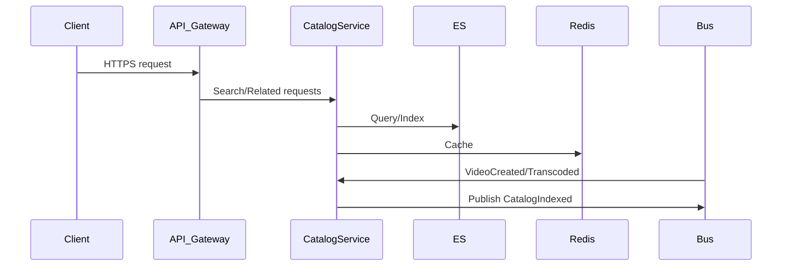

# Catalog & Search Service

Indexes and searches video metadata, supports filtering, pagination, and related video lookups.

## Responsibilities

-   Subscribe to `VideoCreated` and `VideoTranscoded` events
-   Index metadata into Elasticsearch/OpenSearch
-   Provide full-text search with filters (genre, year, tags)
-   Serve related/similar video recommendations based on metadata

## API Endpoints

| Method | Path                 | Description                                         |
| ------ | -------------------- | --------------------------------------------------- |
| GET    | /search              | Full-text search                                    |
|        |                      | Query params: `q`, `genre`, `year`, `page`, `limit` |
| GET    | /videos/{id}/related | Fetch related videos                                |
|        |                      | Query params: `limit`                               |

## Data Store

-   Elasticsearch/OpenSearch index with shards and replicas
-   Redis for caching hot search results (TTL 30s)

## Events

-   Consumes `VideoCreated` and `VideoTranscoded`
-   Publishes `CatalogIndexed` on successful indexing

## Implementation Details

## Non-Functional Requirements

-   Near-real-time indexing (lag < 5s)
-   Query latency < 100 ms (p95)
-   Bulk indexing with retry and backoff for resilience

#### Deployment & Configuration

-   Kubernetes StatefulSet for Elasticsearch/OpenSearch cluster
-   Sidecar indexing service: 3 replicas
-   ConfigMap for index name, batch size, cache TTL

#### Security & Compliance

-   IP filtering for admin/indexing operations
-   Read-only user credentials for search queries

#### Performance & Scalability

-   Bulk API: max 500 docs/batch with 3× retries
-   Edge_ngram analyzers for autocomplete
-   Redis caching (TTL 30s) for hot search results

#### Observability & Monitoring

-   Logging: Pino structured JSON logs to ELK
-   Metrics: Prometheus histograms for indexing time, search latency, cache hit/miss
-   Tracing: OpenTelemetry spans for event handling and search queries

#### CI/CD & Testing

-   GitHub Actions: unit tests (Jest), integration tests with local ES Docker image
-   Docker image build and push

#### Boundary & Data Flow

-   Subscribes to `VideoCreated` and `VideoTranscoded` events from the message bus to update search index.
-   Indexes video metadata into Elasticsearch/OpenSearch.
-   Receives search and related-videos queries via API Gateway.
-   Publishes `CatalogIndexed` events on successful index updates for downstream monitoring or auditing.

## End-to-End Flow

