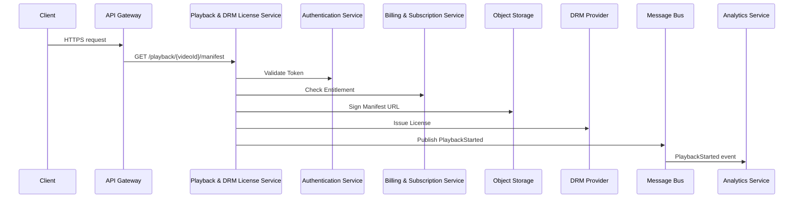

# Playback & DRM License Service

Handles manifest generation and DRM license issuance, enforcing user entitlements and secure playback.

## Responsibilities

-   Generate signed, time-limited URLs for HLS/DASH manifests
-   Issue DRM licenses for encrypted video tracks (Widevine, PlayReady, FairPlay)
-   Enforce subscription and entitlement checks
-   Log playback events for analytics

## API Endpoints

| Method | Path                         | Description                         |
| ------ | ---------------------------- | ----------------------------------- |
| GET    | /playback/{videoId}/manifest | Get signed manifest URL             |
|        |                              | Query params: `token` (JWT)         |
| POST   | /drm/license                 | Issue DRM license                   |
|        |                              | Body: `{ videoId, licenseRequest }` |

## Data Stores

-   Redis or in-memory store for session tokens and issued licenses (TTL 5m)
-   Secure key store (Vault or HSM) for DRM keys

## Events

-   Publishes `PlaybackStarted`, `LicenseIssued`, `PlaybackError` to Analytics bus

## Implementation Details

### Non-Functional Requirements

-   Latency < 50ms per license request
-   TTL-limited signed URLs and licenses (5m)
-   Rate limit: 200 req/s per user
-   99.9% uptime

#### Deployment & Configuration

-   Docker container on Kubernetes, 2+ replicas, HPA on CPU/memory
-   ConfigMap/Secrets for DRM provider endpoints, HMAC signing keys, Redis URL
-   Liveness/readiness probes on `/health`

#### Security & Compliance

-   JWT validation middleware for entitlement checks
-   Mutual TLS for `/drm/license` endpoint
-   Rate limiting and IP whitelisting
-   DRM keys secured in Vault or HSM

#### Performance & Scalability

-   In-memory cache or Redis cache for signed URLs and licenses
-   Connection pooling for Redis
-   Async license issuance with pre-warmed provider connections

#### Observability & Monitoring

-   Logging: Winston JSON logs with userId, videoId, licenseId to ELK
-   Metrics: Prometheus counters for requests, cache hit/miss, latency histograms
-   Tracing: OpenTelemetry spans for manifest generation and DRM calls
-   Alerts: error rate >1%, p95 latency >50ms

#### CI/CD & Testing

-   GitHub Actions: lint, Jest unit tests, integration tests with DRM emulator and mock Auth/Billing services
-   Docker image build and push
-   Contract tests for entitlement and license issuance

## End-to-End Flow

