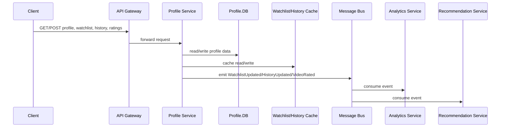

# User Profile Service

Manages user profiles, watchlists, viewing history, and ratings/reviews.

## Responsibilities

-   Profile CRUD: name, avatar, preferences
-   Watchlist: add/remove/list videos
-   Continue Watching: record resume points
-   Ratings & Reviews: submit and fetch
-   Publish domain events (WatchlistUpdated, HistoryUpdated, VideoRated)

## API Endpoints

| Method | Path                                   | Description                 |
| ------ | -------------------------------------- | --------------------------- |
| GET    | /profiles/{userId}                     | Fetch user profile          |
| PUT    | /profiles/{userId}                     | Update user profile         |
| GET    | /profiles/{userId}/watchlist           | List watchlist items        |
| POST   | /profiles/{userId}/watchlist           | Add video to watchlist      |
| DELETE | /profiles/{userId}/watchlist/{videoId} | Remove video from watchlist |
| GET    | /profiles/{userId}/history             | Retrieve viewing history    |
| POST   | /profiles/{userId}/history             | Append history entry        |
| GET    | /profiles/{userId}/ratings             | Retrieve video ratings      |
| POST   | /profiles/{userId}/ratings             | Submit rating/review        |

## Data Stores & Caching

-   PostgreSQL (connection pool: max 30 clients, statement caching)
-   Redis for caching user watchlist and history (TTL configurable, default 5m)

## Events Published

-   `WatchlistUpdated`
-   `HistoryUpdated`
-   `VideoRated`

## Implementation Details

## Non-Functional Requirements

-   Read latency < 50ms
-   Idempotent writes for watchlist/history
-   Rate limiting: 200 req/min per user

#### Deployment & Configuration

-   Docker container on Kubernetes, 3+ replicas, HPA on CPU/memory, liveness/readiness on `/health`
-   Database migrations via Flyway/Knex
-   Config: Redis cache TTL=5m, PostgreSQL pool max 30 clients

#### Security & Compliance

-   JWT auth middleware, RBAC enforcement by roles
-   Input validation using Joi/TypeScript schemas
-   CORS restricted to trusted origins

#### Performance & Scalability

-   Redis caching (TTL=5m) for watchlist and history
-   PostgreSQL statement caching and connection pooling
-   Rate limiter middleware 200 req/min per user

#### Observability & Monitoring

-   Logging: Pino structured JSON logs to ELK
-   Metrics: Prometheus histograms for read/write latency, cache hit/miss
-   Tracing: OpenTelemetry auto-instrumentation for HTTP and DB calls

#### CI/CD & Testing

-   GitHub Actions: lint, Jest unit tests, Supertest integration tests with Testcontainers
-   Mocks: in-memory Postgres and Redis for tests

#### Boundary & Data Flow

-   Receives profile, watchlist, history, and rating API requests via API Gateway authenticated with JWT.
-   Reads and writes user profile data in PostgreSQL; caches and invalidates in Redis.
-   Publishes `WatchlistUpdated`, `HistoryUpdated`, and `VideoRated` events to the message bus for analytics and recommendation services.

## End-to-End Flow

