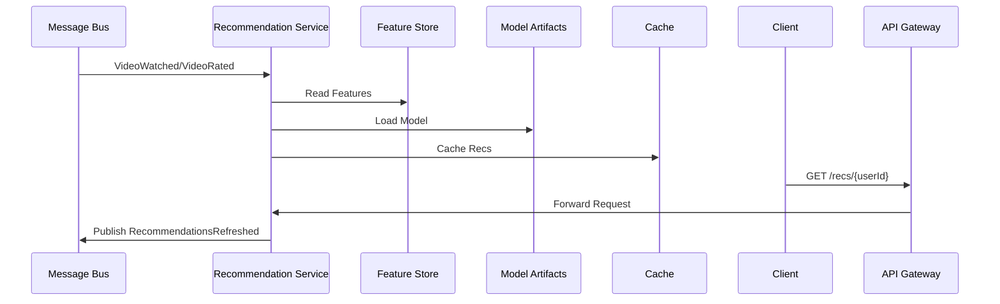

# Recommendation Service

Generates personalized video recommendations using rule-based and ML-based models.

## Responsibilities

-   Fetch and serve personalized "You may also like" lists
-   Support both real-time (online) and batch (offline) recommendation models
-   Trigger and monitor batch model training jobs
-   Expose endpoints for recommendation configuration and model status

## API Endpoints

| Method | Path              | Description                                       |
| ------ | ----------------- | ------------------------------------------------- |
| GET    | /recs/{userId}    | Fetch top-N recommendations for a user            |
|        |                   | Query params: `limit` (default 10), `type`        |
| POST   | /recs/train       | Trigger batch retraining of recommendation models |
|        |                   | Body: `{ modelType, startDate?, endDate? }`       |
| GET    | /recs/models      | List available models and versions                |
| GET    | /recs/models/{id} | Get status and metadata of a specific model       |

## Data Stores

-   Primary store for user interactions and features: PostgreSQL or NoSQL (e.g., Cassandra)
-   Vector database (optional) for embedding lookup (e.g., Pinecone, Milvus)
-   Redis for caching recommendations per user (TTL 1h)
-   Object storage (S3) for persisting trained model artifacts

## Events

-   Consumes `VideoWatched` and `VideoRated` events from Analytics bus
-   Publishes `ModelTrainingStarted`, `ModelTrainingCompleted`, `RecommendationsRefreshed`

## Non-Functional Requirements

-   Offline training every 24h
-   API latency < 200ms p95
-   Rate limiting: 500 req/min per user
-   Model versioning and rollback capabilities

#### Deployment & Configuration

-   Docker container on Kubernetes, 3+ replicas, HPA on CPU and request latency
-   ConfigMap/Secrets for model server endpoints, S3 bucket for artifacts
-   Liveness/readiness probes on `/health`

#### Security & Compliance

-   JWT auth middleware for all endpoints
-   RBAC for training APIs
-   TLS for all inter-service calls

#### Performance & Scalability

-   Redis caching of recommendations per user (TTL 1h)
-   Vector DB for embedding lookups (optional)
-   Connection pooling for PostgreSQL/NoSQL stores

#### Observability & Monitoring

-   Logging: structured JSON via Winston/Zap to ELK
-   Metrics: Prometheus counters and histograms for inference latency, training job durations, cache hit/miss
-   Tracing: OpenTelemetry spans for API calls, DB access, model inference and training tasks
-   Alerts: inference error rate >1%, training job failures

#### CI/CD & Testing

-   GitHub Actions: lint, unit tests (Jest/Pytest), integration tests with localstack/MinIO and mock events
-   Docker image build and push on merge
-   Contract tests between inference service and API Gateway

#### Boundary & Data Flow

-   Receives prediction requests via API Gateway
-   Consumes `VideoWatched`/`VideoRated` events from Analytics bus
-   Reads features from primary store and optional Vector DB
-   Loads model artifacts from S3 and serves predictions
-   Emits `RecommendationsRefreshed` after retraining completion

## End-to-End Flow

