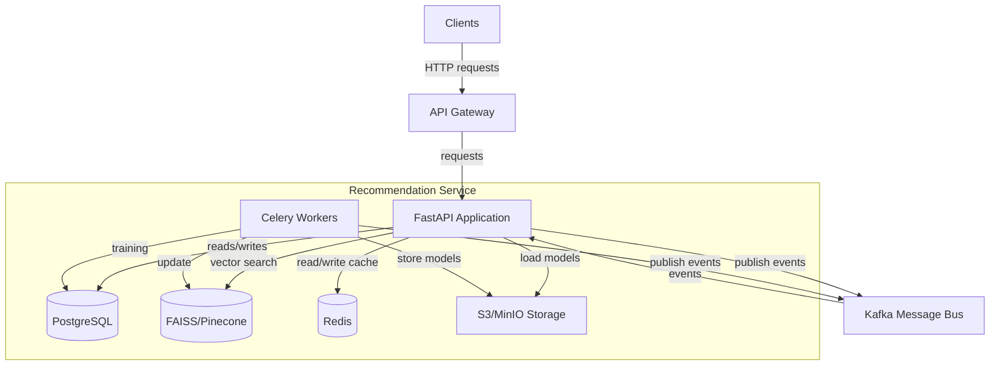
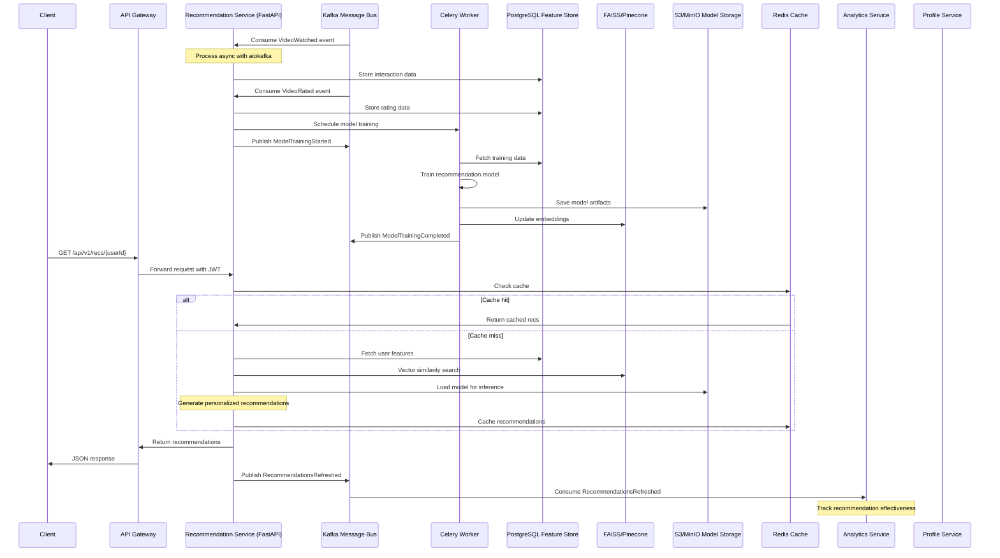

# Recommendation Service

Generates personalized video recommendations using rule-based and ML-based models with Python and FastAPI.

## Technology Stack

-   **Language**: Python 3.11+
-   **Framework**: FastAPI 0.104+ (async web framework)
-   **API Documentation**: OpenAPI with Swagger UI and ReDoc
-   **Machine Learning**: scikit-learn, PyTorch, and/or TensorFlow
-   **Feature Store**: PostgreSQL with SQLAlchemy ORM
-   **Vector Database**: FAISS or Pinecone for efficient vector similarity search
-   **Message Queue**: Kafka with aiokafka for async event consumption
-   **Caching**: Redis with aioredis for async access
-   **Storage**: AWS S3 or MinIO (S3-compatible) for model artifacts
-   **Background Jobs**: Celery with Redis broker for training tasks
-   **Dependency Injection**: FastAPI's built-in DI system
-   **Testing**: pytest, pytest-asyncio, httpx for async HTTP testing
-   **Validation**: Pydantic for request/response validation and data modeling

## Responsibilities

-   Fetch and serve personalized "You may also like" lists
-   Support both real-time (online) and batch (offline) recommendation models
-   Trigger and monitor batch model training jobs
-   Expose endpoints for recommendation configuration and model status
-   Implement A/B testing capability for recommendation algorithms

## API Endpoints

| Method | Path                     | Description                                                                   |
| ------ | ------------------------ | ----------------------------------------------------------------------------- |
| GET    | /api/v1/recs/{userId}    | Fetch top-N recommendations for a user                                        |
|        |                          | Query params: `limit` (default 10), `type`, `experiment_id`                   |
| POST   | /api/v1/recs/train       | Trigger batch retraining of recommendation models                             |
|        |                          | Body: `{ "model_type": str, "start_date": datetime?, "end_date": datetime? }` |
| GET    | /api/v1/recs/models      | List available models and versions                                            |
| GET    | /api/v1/recs/models/{id} | Get status and metadata of a specific model                                   |
| GET    | /api/v1/recs/experiments | List active A/B testing experiments                                           |
| GET    | /health                  | Health check endpoint                                                         |
| GET    | /metrics                 | Prometheus metrics endpoint                                                   |
| GET    | /docs                    | OpenAPI documentation (Swagger UI)                                            |

## Data Stores

-   **Feature Store**: PostgreSQL with SQLAlchemy for user interactions and features
    -   Connection pooling with asyncpg for async database access
    -   Separate schemas for model features, training data, and experiments
-   **Vector Database**: FAISS (in-memory or disk-based) or Pinecone (cloud service)
    -   Vector embeddings for content-based and collaborative filtering
    -   Asynchronous client adapter for non-blocking operations
-   **Redis**: For caching recommendations per user (TTL 1h)
    -   aioredis client for async operations
    -   Hierarchical caching strategy: user-level and segment-level
-   **Object Storage (S3/MinIO)**: For persisting trained model artifacts
    -   boto3/aiobotocore for async access to model binaries
    -   Version-controlled models with metadata

## Events

### Consumed Events

-   `VideoWatched` from Analytics service
    -   Schema: `{ "user_id": str, "video_id": str, "watched_duration": int, "total_duration": int, "timestamp": datetime, "device": str }`
-   `VideoRated` from Profile service
    -   Schema: `{ "user_id": str, "video_id": str, "rating": float, "timestamp": datetime }`
-   `WatchlistUpdated` from Profile service
    -   Schema: `{ "user_id": str, "video_id": str, "action": "added"|"removed", "timestamp": datetime }`

### Published Events

-   `ModelTrainingStarted`
    -   Schema: `{ "model_id": str, "model_type": str, "training_id": str, "start_time": datetime, "parameters": object }`
-   `ModelTrainingCompleted`
    -   Schema: `{ "model_id": str, "training_id": str, "status": "success"|"failed", "metrics": object, "artifact_path": str, "completion_time": datetime }`
-   `RecommendationsRefreshed`
    -   Schema: `{ "user_id": str, "recommendation_ids": array<str>, "model_id": str, "timestamp": datetime }`

## Implementation Details

### Architecture

-   Clean Architecture with distinct layers:
    -   **Domain**: Core models, interfaces, and business logic
    -   **Application**: Use cases and service interfaces
    -   **Infrastructure**: Database repositories, event handlers, and external services
    -   **API**: FastAPI routes and controllers
-   Dependency Injection for testability and flexibility
-   Async IO throughout the stack for optimal performance

### Recommendation Algorithms

-   **Content-based filtering**: Using video metadata and tags
-   **Collaborative filtering**: Matrix factorization with implicit feedback
-   **Hybrid recommendations**: Combining content-based and collaborative techniques
-   **Deep learning**: Optional neural network models for complex patterns
-   **A/B testing framework**: For algorithm comparison and optimization

## Non-Functional Requirements

-   Offline training scheduled every 24h via Celery Beat
-   API latency < 200ms p95
-   Rate limiting: 500 req/min per user via FastAPI middleware
-   Model versioning and rollback capabilities with S3 versioning
-   Graceful degradation to simpler models upon failure

#### Deployment & Configuration

-   Docker multi-stage build with Python slim base image
-   Kubernetes deployment with 3+ replicas, horizontal pod autoscaling (HPA) based on CPU and request latency
-   Separate deployments for API service and Celery workers
-   ConfigMap/Secrets for database credentials, Redis, S3/MinIO access, and Kafka configuration
-   Liveness probe on `/health` and readiness probe on `/health/ready`
-   Migration jobs with Alembic for database schema evolution
-   Environment-specific configuration with Pydantic Settings management

#### Security & Compliance

-   JWT auth middleware for all endpoints using FastAPI Security dependencies
-   RBAC for training APIs with dependency injections for permission checks
-   API key authentication for service-to-service communication
-   TLS for all inter-service calls with certificate validation
-   Input validation via Pydantic models
-   CORS configuration with trusted origins
-   Sanitized error responses to prevent information disclosure

#### Performance & Scalability

-   Async handlers throughout with FastAPI for non-blocking I/O
-   Redis caching of recommendations per user (TTL 1h) with aioredis
-   Multi-level cache strategy: hot users in memory, warm in Redis
-   Vector similarity search with FAISS/Pinecone for fast nearest-neighbor lookups
-   Connection pooling with asyncpg for PostgreSQL (max size: 20)
-   Async Kafka consumer with consumer groups for parallel processing
-   Background training jobs with Celery distributed task queue
-   Efficient feature vector serialization with numpy/msgpack

#### Observability & Monitoring

-   Logging: structured JSON via Python's logging with JSON formatter to ELK
    -   Context-aware logging with correlation IDs
    -   Log rotation and retention policies
-   Metrics: Prometheus client with FastAPI integration
    -   Custom metrics for model performance, inference latency
    -   Histogram for recommendation quality and cache hit/miss ratio
    -   Gauge for training job queue depth
-   Tracing: OpenTelemetry with FastAPI middleware
    -   Distributed tracing across message bus and API boundaries
    -   Span annotations for model inference steps
    -   Integration with Jaeger/Zipkin collectors
-   Alerts:
    -   Inference error rate >1%
    -   Training job failures
    -   p95 latency exceeding 500ms
    -   Cache hit ratio below 80%

#### CI/CD & Testing

-   GitHub Actions workflow:
    -   Static analysis: mypy, pylint, black, isort
    -   Unit tests: pytest with pytest-asyncio for async testing
    -   Integration tests: testcontainers for PostgreSQL, Redis, and MinIO
    -   Contract tests: using Pact for consumer-driven contracts with API Gateway
    -   Performance tests: locust for load testing
-   Test coverage reporting with pytest-cov (target: >85%)
-   Docker image security scanning with Trivy
-   Automated model quality testing framework
-   Pre-commit hooks for code quality enforcement

#### Boundary & Data Flow

-   Receives prediction requests via API Gateway with standardized authentication
-   Consumes domain events from Kafka topics using aiokafka:
    -   `analytics-service.video-watched` for viewing history
    -   `profile-service.video-rated` for explicit ratings
    -   `profile-service.watchlist-updated` for implicit signals
-   Reads features from PostgreSQL using async SQLAlchemy
-   Performs vector similarity search with FAISS/Pinecone for content-based recommendations
-   Loads model artifacts from S3/MinIO using versioned paths
-   Serves predictions with optional explanations via FastAPI endpoints
-   Emits domain events to Kafka topics:
    -   `recommendation-service.model-training-started`
    -   `recommendation-service.model-training-completed`
    -   `recommendation-service.recommendations-refreshed`

## Project Structure

```
recommend-service/
├── README.md                  # This documentation
├── pyproject.toml            # Python dependencies and build settings
├── Dockerfile                # Multi-stage build
├── docker-compose.yml        # Local development setup
├── .github/                  # GitHub Actions workflows
├── alembic/                  # Database migrations
├── app/
│   ├── __init__.py
│   ├── main.py               # FastAPI application entrypoint
│   ├── config.py             # Configuration using Pydantic Settings
│   ├── domain/               # Domain models and business logic
│   │   ├── models.py         # Pydantic domain models
│   │   ├── interfaces.py     # Repository and service interfaces
│   │   └── exceptions.py     # Domain-specific exceptions
│   ├── application/          # Application services and use cases
│   │   ├── recommendation.py # Recommendation service
│   │   ├── model_training.py # Training coordinator
│   │   └── events.py         # Event handlers
│   ├── infrastructure/       # External systems adapters
│   │   ├── database/         # PostgreSQL repositories
│   │   ├── events/           # Kafka producers/consumers
│   │   ├── cache/            # Redis caching layer
│   │   ├── vector_store/     # FAISS/Pinecone integration
│   │   └── storage/          # S3/MinIO integration
│   ├── api/                  # FastAPI route definitions
│   │   ├── v1/               # API v1 routes
│   │   ├── dependencies.py   # FastAPI dependencies
│   │   └── middleware.py     # API middleware (auth, logging)
│   ├── models/               # ML model implementations
│   │   ├── content_based.py  # Content-based filtering
│   │   ├── collaborative.py  # Collaborative filtering
│   │   └── hybrid.py         # Hybrid recommendation models
│   └── tasks/                # Celery tasks
│       ├── celery_app.py     # Celery configuration
│       └── training.py       # Model training tasks
└── tests/                    # Test suite
    ├── unit/                 # Unit tests
    ├── integration/          # Integration tests
    └── fixtures/             # Test fixtures
```

## Service Architecture



## End-to-End Flow


