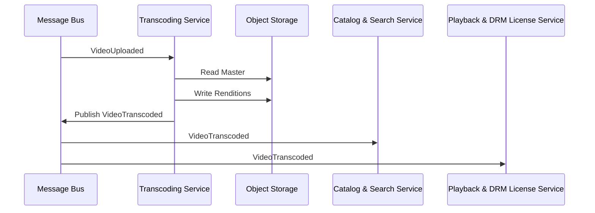

# Transcoding Service

Converts uploaded master video files into adaptive bitrate renditions (HLS/DASH) and publishes completion events.

## Responsibilities

-   Subscribe to `VideoUploaded` events
-   Transcode master files into multiple renditions
-   Upload renditions to S3-compatible storage
-   Publish `VideoTranscoded` events
-   Track job status and metadata

## Data Stores

-   PostgreSQL job table for status, idempotency, retries (pool max 30)
-   S3 for input masters and output renditions

## Implementation Details

## Non-Functional Requirements

-   Parallel processing: configurable concurrency
-   Retry policy: 3 attempts with exponential backoff, dead-letter queue on failure
-   Idempotency: skip duplicate job UUIDs

#### Deployment & Configuration

-   Kubernetes Job workers, configurably-sized replica sets
-   ConfigMap/Secrets for queue URLs (SQS/RabbitMQ), S3 bucket names, concurrency limits
-   Liveness and readiness probe on `/health`

#### Security & Compliance

-   IAM roles for secure S3 access
-   VPC isolation or private networking to queue and storage

#### Performance & Scalability

-   FFMPEG via `fluent-ffmpeg` with preset profiles and multi-threading
-   Queue prefetch and batch size tuned for throughput
-   S3 multipart upload for large renditions

#### Observability & Monitoring

-   Logging: Pino structured JSON logs sent to ELK, include job and video IDs
-   Metrics: Prometheus counters (jobs started/succeeded/failed), histograms for job duration
-   Tracing: OpenTelemetry spans for queue processing, DB and FFMPEG steps

#### CI/CD & Testing

-   GitHub Actions: lint, unit tests (Jest), integration tests with LocalStack SQS/S3 mocks
-   Docker image build and publish on successful pipeline

#### Boundary & Data Flow

-   Subscribes to `VideoUploaded` events from the message bus.
-   Persists job status and idempotency info in PostgreSQL.
-   Reads master files from S3, writes renditions back to S3.
-   Publishes `VideoTranscoded` events on successful completion.

## End-to-End Flow

