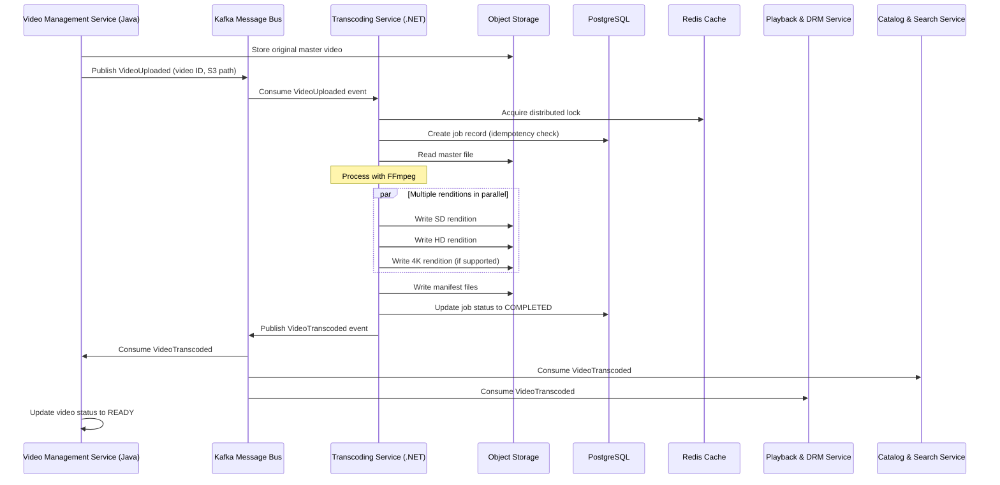

# Transcoding Service

Converts uploaded master video files into adaptive bitrate renditions (HLS/DASH) and publishes completion events.

## Responsibilities

- Subscribe to `VideoUploaded` events from Video Management Service
- Transcode master files into multiple renditions with optimized encoding profiles
- Upload renditions to S3-compatible storage with proper metadata
- Publish `VideoTranscoded` events with complete manifest information
- Track job status and metadata for monitoring and troubleshooting
- Provide status API endpoints for job progress tracking
- Support multi-tenant access control with service-to-service authentication

## Data Stores

- PostgreSQL job table for status, idempotency, retries (connection pooling with 30 max connections)
- S3 for input masters and output renditions with consistent naming conventions
- Redis for distributed job locks and temporary caching of job status

## Implementation Details

- .NET 8 Worker Service with hosted background services
- Entity Framework Core for database access with optimized query patterns
- FFmpeg wrapper library (e.g., Xabe.FFmpeg) for transcoding with configurable quality profiles
- MassTransit for message handling with Kafka integration matching Video Management Service
- AWSSDK.S3 for S3 storage operations with TransferUtility for large file handling
- OpenAPI endpoints for service-to-service communication

## Non-Functional Requirements

- Parallel processing: configurable concurrency with TPL Dataflow or Parallel.ForEach
- Retry policy: 3 attempts with exponential backoff using Polly, dead-letter queue on failure
- Idempotency: skip duplicate job UUIDs with distributed locking via Redis

#### Deployment & Configuration

- Kubernetes Job workers with auto-scaling based on queue depth
- ASP.NET Core configuration system with secrets, environment variables, and config files
- ConfigMap/Secrets for queue configuration, S3 bucket names, concurrency limits
- Health checks middleware with `/health` endpoint aligned with Video Management Service conventions

#### Security & Compliance

- IAM roles for secure S3 access
- JWT token validation matching Video Management Service for service-to-service authentication
- VPC isolation or private networking to queue and storage
- Request throttling with rate limits

#### Performance & Scalability

- FFmpeg with optimized preset profiles and multi-threading matching content requirements
- Queue prefetch and batch size tuned for throughput with MassTransit
- S3 multipart upload for large renditions using AWSSDK.S3 TransferUtility
- Horizontal scaling with stateless workers and shared job state in PostgreSQL

#### Observability & Monitoring

- Logging: Serilog structured logging with Elastic sink for ELK integration, matching format from other services
- Metrics: OpenTelemetry with Prometheus exporter for ASP.NET Core metrics
- Tracing: OpenTelemetry with Jaeger or Zipkin for distributed tracing with trace context propagation
- Application Insights integration for comprehensive monitoring with shared workspace
- Custom dashboard with transcoding success rates, job durations, and error tracking

#### CI/CD & Testing

- GitHub Actions: dotnet build, test (xUnit/NUnit), code coverage with Coverlet
- Docker image build and publish with multi-stage Dockerfile
- Integration tests using TestContainers for SQL and LocalStack for S3/Kafka
- Blazor-based management dashboard for transcoding jobs

#### Boundary & Data Flow

- Subscribes to `VideoUploaded` events from Kafka topics produced by Video Management Service
- Persists job status and idempotency info in PostgreSQL via EF Core
- Reads master files from S3, writes renditions back to S3 using AWSSDK.S3
- Publishes `VideoTranscoded` events with standardized payload format compatible with Catalog and Playback services
- Exposes REST APIs for job status queries with JWT authentication

## Integration Details

### Video Management Service Integration

- Consumes `video-service.video-uploaded` topic to trigger transcoding jobs
- Publishes to `transcoding-service.video-transcoded` topic when job completes
- Uses consistent event schema with Video Management's existing events
- Follows same JWT authentication pattern for service-to-service communication

### Playback and DRM Service Integration

- Provides standardized manifest formats (HLS/DASH) compatible with Playback service
- Includes standardized DRM signaling in manifests
- Outputs rendition naming convention aligned with Playback service expectations

### Analytics Service Integration

- Emits detailed transcoding metrics for consumption by Analytics service
- Publishes job completion events with quality metrics and encoding parameters

### Catalog & Search Service Integration

- Includes technical metadata in `VideoTranscoded` events for catalog enrichment
- Provides standardized resolution and bitrate information for filtering

## End-to-End Flow

