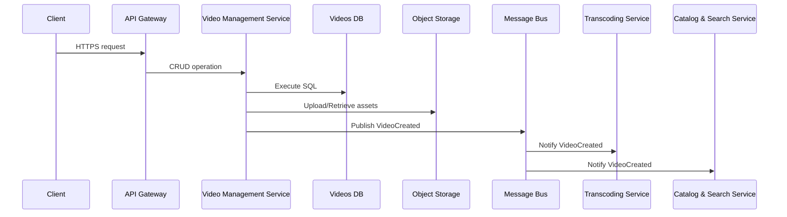

# Video Management Service

Handles video metadata lifecycle, ingestion triggers, and thumbnail management.

## Responsibilities

-   CRUD operations for video metadata (title, description, tags, thumbnails)
-   Trigger ingestion and transcoding workflows upon new uploads
-   Orchestrate thumbnail generation
-   Publish domain events for downstream services

## API Endpoints

| Method | Path         | Description                           |
| ------ | ------------ | ------------------------------------- |
| POST   | /videos      | Create video metadata (pending state) |
| GET    | /videos/{id} | Retrieve video metadata               |
| GET    | /videos      | List videos with pagination & filters |
| PUT    | /videos/{id} | Update video metadata                 |
| DELETE | /videos/{id} | Delete video metadata                 |

## Data Stores

-   PostgreSQL (`videos` table) with 20 max connections, prepared statements
-   S3-compatible object storage for raw uploads and thumbnails

## Events Published

-   `VideoCreated` (metadata ready)
-   `VideoDeleted`
-   `VideoUploaded` (raw file in storage)

## Implementation Details

#### Boundary & Data Flow

-   Receives CRUD requests for video metadata via API Gateway.
-   Persists metadata in PostgreSQL and uploads raw assets to S3.
-   Emits `VideoCreated` and `VideoDeleted` events on the message bus for Transcoding and Catalog/Search services.
-   Emits `VideoUploaded` event when a raw file lands in S3 to trigger Transcoding Service.

## Non-Functional Requirements

-   Graceful backoff on S3 failures
-   Audit logs for admin actions

#### Deployment & Configuration

-   Docker & Kubernetes: 3 replicas, readiness/liveness probes on `/health`
-   Flyway migrations for PostgreSQL
-   ConfigMap/Secrets for S3 bucket and retry limits

#### Security & Compliance

-   JWT validation middleware
-   RBAC enforcement on update/delete operations
-   TLS encryption for S3 and HTTP endpoints

#### Performance & Scalability

-   AWS SDK v3 with exponential backoff retry (max 5 retries)
-   PostgreSQL connection pool: max 20 clients

#### Observability & Monitoring

-   Logging: Winston JSON logs to ELK
-   Metrics: Prometheus for DB latency, S3 operations, event publish stats
-   Tracing: OpenTelemetry spans for HTTP, DB, and S3 calls

#### CI/CD & Testing

-   GitHub Actions: Jest unit tests, integration tests with LocalStack S3
-   Docker image build and push to registry

## End-to-End Flow

