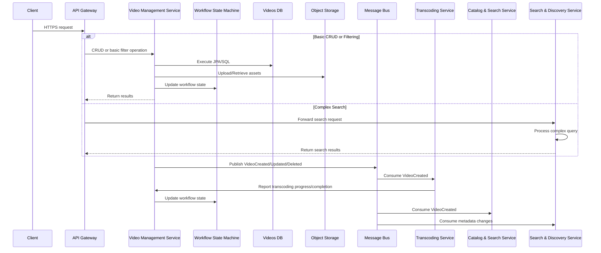

# Video Management Service

Handles video metadata lifecycle, ingestion triggers, thumbnail management, and enterprise-grade features.

## Technology Stack

-   **Language**: Java 21
-   **Framework**: Spring Boot 3.3
-   **API**: Spring Web, Spring HATEOAS
-   **Database**: PostgreSQL with Spring Data JPA/Hibernate
-   **Object Storage**: AWS SDK for S3 (or MinIO for local development)
-   **Messaging**: Spring Cloud Stream with Kafka
-   **Build Tool**: Gradle (with Kotlin DSL)
-   **Documentation**: SpringDoc OpenAPI (Swagger)
-   **Testing**: JUnit 5, Mockito, Testcontainers
-   **Security**: Spring Security with JWT
-   **Observability**: Micrometer, Spring Actuator, OpenTelemetry
-   **Migration**: Flyway for database migrations
-   **Containerization**: Docker, Kubernetes with Helm charts
-   **Multi-tenancy**: Custom tenant isolation through query filtering
-   **Partitioning**: PostgreSQL table partitioning for scalability
-   **Archiving**: Tiered storage with automated data lifecycle

## Responsibilities

-   CRUD operations for video metadata (title, description, tags, thumbnails)
-   Trigger ingestion and transcoding workflows upon new uploads
-   Orchestrate thumbnail generation
-   Publish domain events for downstream services
-   Basic filtering and pagination for video metadata queries
-   Multi-tenant data isolation
-   GDPR compliance features (data export, right to be forgotten)
-   Automated data archiving and retention policies

## API Endpoints

| Method | Path                           | Description                           |
| ------ | ------------------------------ | ------------------------------------- |
| POST   | /api/v1/videos                 | Create video metadata (pending state) |
| GET    | /api/v1/videos/{id}            | Retrieve video metadata               |
| GET    | /api/v1/videos                 | List videos with pagination & filters |
| PUT    | /api/v1/videos/{id}            | Update video metadata                 |
| DELETE | /api/v1/videos/{id}            | Delete video metadata                 |
| GET    | /api/v1/videos/filter          | Basic filtering on metadata fields    |
| GET    | /api/v1/videos/categories/{id} | List videos by category               |
| GET    | /api/v1/videos/tags/{tag}      | List videos by tag                    |
| GET    | /actuator/health               | Health check endpoint                 |
| GET    | /actuator/metrics              | Metrics endpoint                      |

## Query Parameters for Basic Filtering

| Parameter | Description                               | Example                           |
| --------- | ----------------------------------------- | --------------------------------- |
| category  | Filter by category ID                     | /api/v1/videos?category=action    |
| year      | Filter by release year                    | /api/v1/videos?year=2025          |
| sort      | Sort field and direction                  | /api/v1/videos?sort=released,desc |
| page      | Page number (0-based)                     | /api/v1/videos?page=2             |
| size      | Page size (default: 20, max: 100)         | /api/v1/videos?size=50            |
| language  | Filter by language                        | /api/v1/videos?language=en        |
| tags      | Filter by multiple tags (comma-separated) | /api/v1/videos?tags=comedy,family |

## Data Model

```java
@Entity
@Table(name = "videos")
public class Video {
    @Id
    @GeneratedValue(strategy = GenerationType.UUID)
    private UUID id;

    @Column(nullable = false)
    private String title;

    @Column(length = 2000)
    private String description;

    @ElementCollection
    @CollectionTable(name = "video_tags", joinColumns = @JoinColumn(name = "video_id"))
    private Set<String> tags = new HashSet<>();

    @ManyToOne
    @JoinColumn(name = "category_id")
    private Category category;

    @Column(name = "release_year")
    private Integer releaseYear;

    @Column(length = 10)
    private String language;

    @OneToMany(mappedBy = "video", cascade = CascadeType.ALL, orphanRemoval = true)
    private List<Thumbnail> thumbnails = new ArrayList<>();

    @Enumerated(EnumType.STRING)
    @Column(nullable = false)
    private VideoStatus status = VideoStatus.PENDING;

    @Column(name = "created_at")
    private LocalDateTime createdAt;

    @Column(name = "updated_at")
    private LocalDateTime updatedAt;

    // Getters, setters, etc.
}

public enum VideoStatus {
    PENDING, UPLOADED, PROCESSING, READY, FAILED, DELETED
}
```

## Data Stores

-   PostgreSQL (`videos` table) with HikariCP connection pool (max 20 connections)
-   S3-compatible object storage for raw uploads and thumbnails

## Events Published (Kafka Topics)

-   `video-service.video-created` (metadata ready)
-   `video-service.video-deleted`
-   `video-service.video-uploaded` (raw file in storage)
-   `video-service.video-updated` (metadata modified - for search indexing)
-   `video-service.video-tagged` (tags modified - for search indexing)
-   `video-service.video-categorized` (category modified - for search indexing)

## Implementation Details

#### Architecture

-   Hexagonal/Clean Architecture with domain-driven design
-   Domain layer with entities, value objects, and domain services
-   Application layer with use cases/service interfaces
-   Infrastructure layer with repositories, messaging, and external service adapters
-   Presentation layer with REST controllers and DTOs
-   Workflow orchestration with Spring Statemachine for video processing

#### Boundary & Data Flow

-   Receives CRUD requests for video metadata via API Gateway.
-   Persists metadata in PostgreSQL and uploads raw assets to S3.
-   Emits domain events on Kafka topics for Transcoding and Search services.
-   Emits `VideoUploaded` event when a raw file lands in S3 to trigger Transcoding Service.
-   Uses Spring's ApplicationEventPublisher for internal events.

#### Search & Discovery Responsibilities

-   The Video Management Service provides **basic filtering** capabilities:
    -   JPA Specification API for dynamic queries
    -   Spring Data's Pageable for pagination and sorting
    -   Native SQL queries for optimized filtering
-   Complex search is delegated to the dedicated Search & Discovery Service:
    -   Full-text search across all fields
    -   Faceted filtering and advanced relevance scoring
    -   Fuzzy matching and personalized results
    -   Search analytics and trending content

## Service Integration - Search & Discovery

1. Video Management Service publishes metadata change events to Kafka
2. Search & Discovery Service consumes events to update search indices
3. Video Management Service does not directly call Search & Discovery Service
4. API Gateway routes search queries to Search & Discovery Service
5. BFF (Backend for Frontend) can combine results when necessary

## Non-Functional Requirements

-   Graceful backoff on S3 failures using resilience4j retry/circuit breaker
-   Audit logs for admin actions using Spring AOP

#### Deployment & Configuration

-   Docker & Kubernetes: 3 replicas, readiness/liveness probes via Spring Actuator `/health`
-   Flyway migrations for PostgreSQL schema management
-   Externalized configuration with Spring Cloud Config Server
-   ConfigMap/Secrets for database, S3 bucket and retry limits
-   Resource limits: 1 CPU, 2GB memory per instance

#### Security & Compliance

-   Spring Security with JWT validation filter
-   Method-level security annotations for RBAC enforcement
-   TLS encryption for S3 and HTTP endpoints
-   Input validation with Hibernate Validator

#### Performance & Scalability

-   AWS SDK v2 with reactive support
-   Connection pooling with HikariCP (max 20 clients)
-   Redis caching layer with Spring Cache abstraction
-   Thread pool optimization for async operations

#### Observability & Monitoring

-   Logging: Logback with JSON formatter, MDC for request tracing
-   Metrics: Micrometer with Prometheus registry
-   Health checks: Spring Boot Actuator
-   Tracing: OpenTelemetry with Jaeger exporter
-   Application Performance Monitoring with Spring Cloud Sleuth
-   Workflow Monitoring: State machine tracking, state transition metrics, and retry tracking

#### CI/CD & Testing

-   GitHub Actions: JUnit tests, integration tests with Testcontainers
-   Dependency vulnerability scanning with OWASP plugin
-   Docker image build and push to registry
-   SonarQube for code quality analysis
-   Contract testing with Spring Cloud Contract

## Video Processing Workflow

The Video Management Service uses Spring Statemachine to coordinate the complex workflow of video processing:


### Workflow States

1. **PENDING** - Initial state when video metadata is created
2. **UPLOADED** - Raw video file is uploaded to storage
3. **VALIDATING** - Validating video format and integrity
4. **TRANSCODING** - Video is being converted to streaming formats
5. **EXTRACTING_METADATA** - Extracting technical metadata
6. **GENERATING_THUMBNAILS** - Creating thumbnail images
7. **READY** - Video is fully processed and ready for streaming
8. **FAILED** - Processing has failed at some stage
9. **DELETED** - Video has been marked for deletion

### Key Workflow Features

-   Event-driven state transitions
-   Persistent state machine with database backing
-   Automatic retry mechanism for failed processing
-   Compensating transactions for cleanup
-   Monitoring via metrics and status endpoints

### Workflow Monitoring API

| Method | Path                                | Description                                  |
| ------ | ----------------------------------- | -------------------------------------------- |
| GET    | /api/v1/workflow/{videoId}/status   | Get current workflow status for a video      |
| GET    | /api/v1/workflow/summary            | Get count of videos in each workflow state   |
| POST   | /api/v1/workflow/{videoId}/retry    | Manually retry processing for a failed video |
| POST   | /api/v1/workflow/{videoId}/rollback | Manually trigger cleanup for a video         |

## End-to-End Flow



## Development Setup

```bash
# Clone the repository
git clone https://github.com/streamflix/video-service.git

# Build the application
./gradlew build

# Run tests
./gradlew test

# Run the application locally
./gradlew bootRun

# Start the application with Docker Compose (includes PostgreSQL and Kafka)
docker-compose up
```

## Deployment

### Kubernetes Deployment

The Video Management Service is designed to be deployed in a Kubernetes environment. Two deployment options are available:

1. **Kubernetes Manifests**: Raw Kubernetes YAML files in the `k8s/` directory
2. **Helm Chart**: A Helm chart is available in the `helm/video-mgmt/` directory

For detailed deployment instructions, please refer to:

-   [Kubernetes Deployment Guide](./k8s/README.md)
-   [Helm Chart Documentation](./helm/video-mgmt/README.md)

#### Key Deployment Features

-   **High Availability**: Multiple replicas with pod disruption budgets
-   **Auto-scaling**: Horizontal Pod Autoscaler based on CPU and memory metrics
-   **Resource Management**: Configurable resource requests and limits
-   **Health Checks**: Liveness, readiness, and startup probes
-   **Observability**: Prometheus metrics, health endpoints, and structured logging
-   **Security**: JWT authentication, TLS, and secrets management

For a complete production deployment guide, see [DEPLOYMENT.md](./DEPLOYMENT.md).

## Reference Documentation

-   [Spring Boot Documentation](https://docs.spring.io/spring-boot/docs/current/reference/html/)
-   [Spring Data JPA](https://docs.spring.io/spring-data/jpa/docs/current/reference/html/)
-   [Spring Cloud Stream](https://docs.spring.io/spring-cloud-stream/docs/current/reference/html/)
-   [AWS SDK for Java](https://docs.aws.amazon.com/sdk-for-java/latest/developer-guide/home.html)

## Enterprise Features

### Multi-tenancy

The Video Management Service supports full multi-tenancy:

-   **Tenant Identification**: Uses the `X-Tenant-ID` header to identify tenants
-   **Data Isolation**: Enforces tenant boundaries at the database level
-   **Tenant Filtering**: Automatically filters all repository operations by tenant
-   **Default Tenant**: Provides a default tenant for backward compatibility

### Data Partitioning

Database tables are partitioned by tenant for scalability and performance:

-   **Hash Partitioning**: Videos, categories, and thumbnails are partitioned by tenant ID
-   **Partition Management**: Automatic partition creation for new tenants
-   **Performance**: Improved query performance for large datasets

### Data Archiving & Retention

Enterprise-grade data lifecycle management:

-   **Configurable Retention**: Retention periods based on tenant subscription level
-   **Tiered Storage**: Videos move from hot storage to cold storage based on age
-   **Scheduled Archiving**: Automatic daily archiving of old/deleted content
-   **Cost Optimization**: Utilizes S3 storage classes for cost efficiency

### GDPR Compliance

Built-in features for data privacy regulation compliance:

-   **Right to Access**: API to export user's personal data in structured format
-   **Right to Erasure**: Secure data anonymization process with grace period
-   **Consent Management**: Tracking of user consent for data processing
-   **Activity Logging**: Comprehensive audit trail of all data processing
-   **Data Minimization**: Automatic purging of unnecessary data

## Enterprise API Endpoints

| Method | Path                              | Description                        |
| ------ | --------------------------------- | ---------------------------------- |
| GET    | /api/v1/gdpr/export/{userId}      | Export user's personal data (GDPR) |
| POST   | /api/v1/gdpr/anonymize/{userId}   | Request user data anonymization    |
| POST   | /api/v1/admin/tenants             | Create a new tenant                |
| GET    | /api/v1/admin/tenants             | List all tenants                   |
| GET    | /api/v1/admin/tenants/{id}        | Get tenant details                 |
| PUT    | /api/v1/admin/tenants/{id}        | Update tenant subscription level   |
| PUT    | /api/v1/admin/tenants/{id}/status | Activate or deactivate a tenant    |
